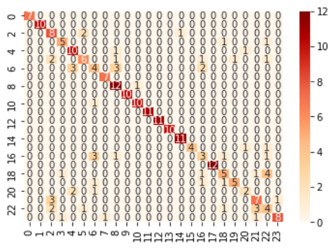

# medic
 <ul>
<li>The android application built using flutter is tested on Android version 13.</li>

<li>The application runs and opens up registration/login and a voice powered button to register/login using voice.</li>
<li>The voice powered button can navigates to pages based on voice inputs as:
	<ul>
	<li>"Hello" - Voice Registation/Login page.</li>
	<li>"Registration" - Textual Registraion Page.</li>
	<li>"Login" - Textual Login.</li>
	</ul>
 </li>

<li>Textual Registration:
	<ul>
	<li>Includes registration for both Doctor/Paitent.</li>
	<li>Phone OTP verification is done and data is stored in firestore databse.</li>
	</ul>
</li>

<li>Textual Login:
	<ul>
	<li>Phone OTP verification using phone number to login.</li>
	</ul>
</li>

<li>Voice Registration:
	<ul>
	<li>Voice powered registration chatbot specifically for paitents.</li>
	</ul>
</li>

<li>Voice Login:
	<ul>
	<li>Voice powered login chatbot using phone number verification with OTP.</li>
	</ul>
</li>

<li>Preliminary medical assessment:
	<ul>
	<li>Voice powered chatbot for preliminary medical assessment using ML model hosted in the localhost using Flask.</li>
	<li>Please run the ML_API.py file in the backgroud for predictions.
	<li>A custom LSTM model is trained to predict diseases given a paragraph of symptoms as input.</li>
	</ul>
</li>

<li>Booking a doctor:
	<ul>
	<li>Available doctors are fetched from the database and users can book desired doctor.</li>
	</ul>
</li>

<li>Doctor's Page:
	<ul>
	<li>Doctor can view the dashboard containing profile details and appointment details.</li>
	</ul>
</li>

</ul>

# ML Model for Preliminary Medical Assessment

<ul>
<li>Three models are trained on a sample kaggle dataset having 1200 symptom paragraphs containing 24 different diseases namely Psoriasis, Varicose Veins, Typhoid, Chicken pox, Impetigo, Dengue, Fungal infection, Common Cold, Pneumonia,  DimorphicHemorrhoids, Arthritis, Acne, BronchialAsthma, Hypertension, Migraine, Cervicalspondylosis, Jaundice, Malaria, urinarytractinfection, allergy, gastroesophagealrefluxdisease, drugreaction, pepticulcerdisease, diabetes.</li>
<li> Data pre-processing includes whitespace removal, stopwords removal, lemmatization, tokenization and padding sequences.</li>
<li> A simple LSTM, encoder-decoder, and attention-based LSTM models are trained, with accuracies 76%, 81% and 85%, respectively.</li>
<li> API is built on Flask, and a new dataset is added which is used to provide basic information, specialist recommendation and suggestions based on the predicted diseases by the three models. </li>
<li>
	
</li>
 
</ul>

# Thank You
