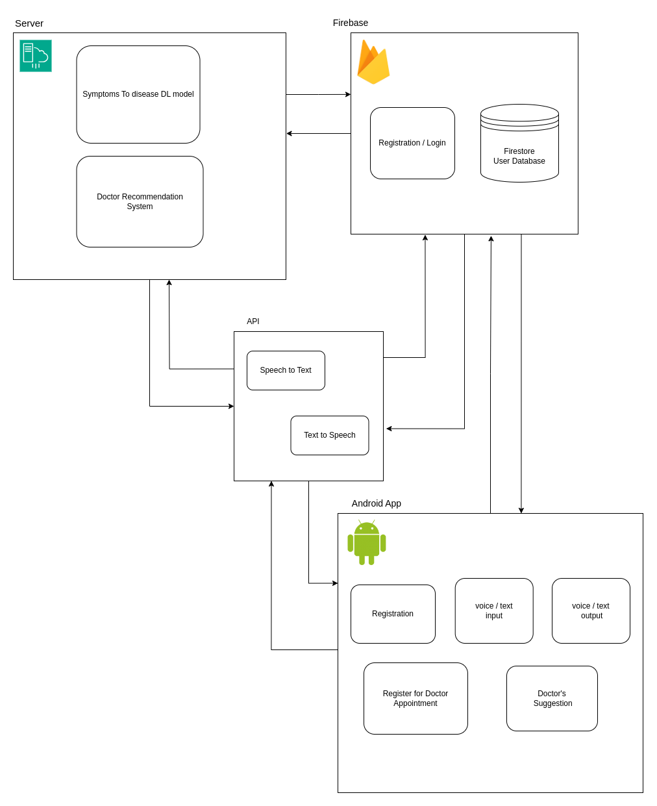
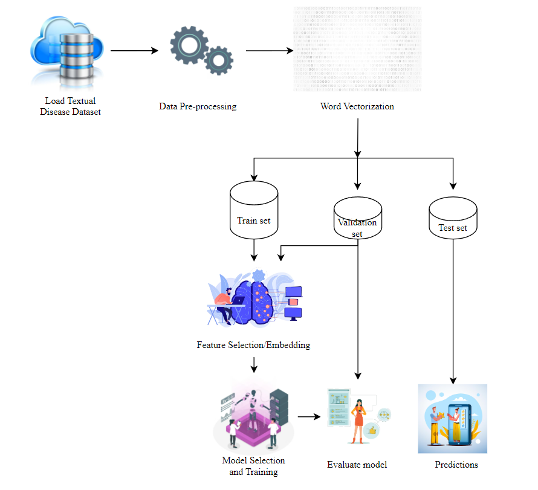

# How to run
<ul>
	<li> Download the repo using <code>git clone https://github.com/Suoregnadrm/medic.git</code> </li>
	<li> Open the <code>Medic</code> folder in <code>Android Studio</code> <i>(Please edit the configurations and set dart-sdk path and get dependencies using <code>flutter pub get</code></i></li>
	<li> Open <code>CMD</code></li>
	<li> Navigate to the path where you downloaded the repo.</li>
	<li> Run <code>ML_API.py</code> using <code>python ML_API.py</code></li>
	<li> Copy the API url.
	<li> Go to <code>assessment.dart</code> and paste the API URL in the <i>function</i><code>_makePrediction</code></li>
	<li> Run the application using <code>flutter run</code> or clicking on the <code>Run</code> button.</li>
	<li> Initially, when a doctor registers in the platform, the status of the doctor is <i>not verified.</i></li>
	<li> The admin is responsible for the verification of the doctors.</li>
	<li> To open the admin dashboard, open <code>CMD</code> and navigate to the <code>admin</code> folder downloaded in the repo.</li>
	<li> Run <code>http-server</code> and click on any given URL.</li>
	<li> <i>If <code>http-server</code> is not installed you can install it using <code>npm install -g http-server</code>.  Additionally if you get any firebase error, run <code>npm install firebase@9.6.0</code></i></li>
 	<li> Open the <code>admin_login.html</code> file to view the admin dashboard.</li>
		
</ul>

# medic
 <ul>
<li>The android application built using flutter is tested on Android version 13.</li>

<li>The application runs and opens up registration/login and a voice powered button to register/login using voice.</li>
<li>The voice powered button can navigates to pages based on voice inputs as:
	<ul>
	<li>"Hello" - Voice Registation/Login page.</li>
	<li>"Registration" - Textual Registraion Page.</li>
	<li>"Login" - Textual Login.</li>
	</ul>
 </li>

<li>Textual Registration:
	<ul>
	<li>Includes registration for both Doctor/Paitent.</li>
	<li>Phone OTP verification is done and data is stored in firestore databse.</li>
	</ul>
</li>

<li>Textual Login:
	<ul>
	<li>Phone OTP verification using phone number to login.</li>
	</ul>
</li>

<li>Voice Registration:
	<ul>
	<li>Voice powered registration chatbot specifically for paitents.</li>
	</ul>
</li>

<li>Voice Login:
	<ul>
	<li>Voice powered login chatbot using phone number verification with OTP.</li>
	</ul>
</li>

<li>Preliminary medical assessment:
	<ul>
	<li>Voice powered chatbot for preliminary medical assessment using ML model hosted in the localhost using Flask.</li>
	<li>Please run the ML_API.py file in the backgroud for predictions.
	<li>A custom LSTM model is trained to predict diseases given a paragraph of symptoms as input.</li>
	</ul>
</li>

<li>Booking a doctor:
	<ul>
	<li>Available doctors are fetched from the database and users can book desired doctor.</li>
	</ul>
</li>
<li>Appointment History:
	<ul>
	<li>View the previously booked appointment history</li>
	</ul>
</li>

<li>Doctor's Page:
	<ul>
	<li>Doctor can view the dashboard containing profile details and appointment details.</li>
	</ul>
</li>

<li>Admin Dashboard:
	<ul>
	<li>Verify the status of the doctor whether he is a verified practitioner or not.</li>
	</ul>
</li>

</ul>

# ML Model for Preliminary Medical Assessment

<ul>
<li>Three models are trained on a sample kaggle dataset having 1200 symptom paragraphs containing 24 different diseases namely Psoriasis, Varicose Veins, Typhoid, Chicken pox, Impetigo, Dengue, Fungal infection, Common Cold, Pneumonia,  DimorphicHemorrhoids, Arthritis, Acne, BronchialAsthma, Hypertension, Migraine, Cervicalspondylosis, Jaundice, Malaria, urinarytractinfection, allergy, gastroesophagealrefluxdisease, drugreaction, pepticulcerdisease, diabetes.</li>
<li> Data pre-processing includes whitespace removal, stopwords removal, lemmatization, tokenization and padding sequences.</li>
<li> A simple LSTM, encoder-decoder, and attention-based LSTM models are trained, with accuracies 76%, 81% and 85%, respectively.</li>
<li> API is built on Flask, and a new dataset is added which is used to provide basic information, specialist recommendation and suggestions based on the predicted diseases by the three models. </li>
</ul>

# Use-Case Diagram
<ul>
	
	<li> The system that takes user input in voice or text. Through API calls this input is converted to text. The textual inputs are fed to a pre-trained ML model for symptoms analysis, also suggesting a doctor according to the predictions. Data is stored in a database (say firestore), be it user data, doctor data, symptoms data or appointment data. Registration and login are handled in the backend. The server maintains the ML model which is used for predictions on the user given inputs. A doctor recommendation system shall also be maintained by the server which handles recommendations based on predictions. The outputs from the server and database are shown to the user in both voice and text.</li>
</ul>

# Architecture Diagram
<ul>
	
</ul>

# ML Model Diagram
<ul>
	
</ul>

# Thank You
